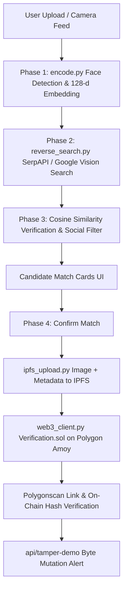

# Forensic Eye — Facial Recognition & Web3 Immutability Monorepo

**Forensic Eye** is an end-to-end full-stack monorepo featuring a **FastAPI backend** (`/backend`) and a **Vite + React frontend** (`/frontend`). It performs facial detection, extracts 128-d embedding vectors, executes reverse image search across web & social platforms (Twitter/X, Instagram, LinkedIn, Reddit), verifies matches using cosine similarity, and commits immutable verification records to IPFS and the Polygon Amoy blockchain.

---

## What It Does

1. **Face Detection & Embedding Extraction (Phase 1)**: Accepts uploaded images or live camera snapshot feeds, detects the primary face, evaluates quality/blur, crops thumbnails, and computes 128-dimensional facial embedding vectors.
2. **Reverse Image Search & Social Filtering (Phase 2)**: Queries SerpAPI Google Lens / Google Vision WEB_DETECTION APIs, filtering candidate web pages to known social media platforms (Twitter/X, Instagram, LinkedIn, Facebook, Reddit).
3. **Facial Cosine Similarity Verification (Phase 3)**: Fetches candidate image thumbnails, recomputes face embeddings, and calculates cosine similarity ($\ge 65\%$) to surface verified matches.
4. **Decentralized Storage & On-Chain Recording (Phase 4)**: Pushes post image + metadata JSON to IPFS and submits `record(bytes32 dataHash, string ipfsCID)` transactions to `Verification.sol` on Polygon Amoy.
5. **Standout Tamper Verification**: Features on-chain hash verification (`/api/verify/{record_id}`) and a deliberate byte mutation demo (`/api/tamper-demo`) proving that altering a single byte in stored content breaks on-chain verification.

---

## Architecture Diagram

```text
┌─────────────────────────────────────────────────────────────────────────────┐
│                            Vite + React Frontend                            │
│           (3-Step Forensic UI: Camera/Upload ──▶ Matches ──▶ On-Chain)      │
└────────────────────────────────────┬────────────────────────────────────────┘
                                     │ HTTP / REST API Proxy (:5173 -> :8000)
┌────────────────────────────────────▼────────────────────────────────────────┐
│                               FastAPI Backend                               │
│                                (/backend/main.py)                           │
├───────────────────┬───────────────────┬───────────────────┬─────────────────┤
│    Face Module    │   Search Module   │    Web3 Chain     │   Job Engine    │
│  (encode.py)      │ (reverse_search)  │  (web3_client)    │(scan_pipeline)  │
│  • 128-d Vector   │ • SerpAPI / Lens  │ • IPFS Upload     │ • Phase 1-3 Scan│
│  • Quality/Blur   │ • Social Filter   │ • Verification.sol│ • Phase 4 Commit│
└─────────┬─────────┴─────────┬─────────┴─────────┬─────────┴─────────────────┘
          │                   │                   │
          ▼                   ▼                   ▼
┌──────────────────┐┌──────────────────┐┌─────────────────────────────────────┐
│   OpenCV / dlib  ││ SerpAPI / Vision ││ IPFS & Polygon Amoy Testnet         │
│  Face Embeddings ││   Search Engine  ││ (Verification.sol - Chain ID 80002) │
└──────────────────┘└──────────────────┘└─────────────────────────────────────┘
```



---

## Setup Steps

### Prerequisites
- **Python 3.10+** (with `uv` or `venv`)
- **Node.js 18+** & **npm**

---

### 1. Environment Configuration

Copy `.env.example` to `.env` in the root directory:
```bash
cp .env.example .env
```

Update placeholders in `.env`:
```env
SERPAPI_KEY=your_serpapi_key_here
WEB3_PROVIDER_URL=https://rpc-amoy.polygon.technology
PRIVATE_KEY=your_polygon_amoy_private_key
CONTRACT_ADDRESS=0x82fA0...your_deployed_contract_address
```

---

### 2. Backend Setup (`/backend`)

1. Navigate to `/backend`:
   ```bash
   cd backend
   ```

2. Create virtual environment using `uv` (or `venv`):
   ```bash
   uv venv
   # Or standard venv: python -m venv .venv
   ```

3. Install dependencies:
   ```bash
   uv pip install -r requirements.txt --python .\.venv\Scripts\python.exe
   # Or standard pip: .venv\Scripts\activate && pip install -r requirements.txt
   ```

4. Start FastAPI server:
   ```bash
   .\.venv\Scripts\python.exe -m uvicorn main:app --reload --port 8000
   ```
   Interactive Swagger docs: [http://localhost:8000/docs](http://localhost:8000/docs)

---

### 3. Frontend Setup (`/frontend`)

1. Open a new terminal in `/frontend`:
   ```bash
   cd frontend
   ```

2. Install dependencies:
   ```bash
   npm install
   ```

3. Start Vite dev server:
   ```bash
   npm run dev
   ```
   Frontend app will open at: [http://localhost:5173](http://localhost:5173)

---

## Testnet & Smart Contract Details

- **Blockchain Network**: Polygon Amoy Testnet
- **Chain ID**: `80002`
- **RPC Provider**: `https://rpc-amoy.polygon.technology`
- **Smart Contract File**: [backend/chain/contracts/Verification.sol](file:///d:/DEV/hhgoa_task3/backend/chain/contracts/Verification.sol)
- **Deployment Script**: [backend/chain/scripts/deploy.js](file:///d:/DEV/hhgoa_task3/backend/chain/scripts/deploy.js)
- **Block Explorer**: [https://amoy.polygonscan.com](https://amoy.polygonscan.com)

### Contract Interface (`Verification.sol`)
```solidity
event RecordStored(bytes32 indexed dataHash, string ipfsCID, address indexed submitter, uint256 timestamp);

function record(bytes32 dataHash, string memory ipfsCID) public;
function getRecord(bytes32 dataHash) public view returns (string memory ipfsCID, address submitter, uint256 timestamp, bool exists);
```

---

## How to Run the Tamper Demo

The **Tamper Demo** proves blockchain immutability by deliberately mutating a byte in the stored metadata and demonstrating that recomputed SHA-256 hashes fail on-chain verification.

### Option A: Via UI
1. Complete a scan and click **"Verify & Record On-Chain"** on any match card.
2. On Step 3 (On-Chain Record), click the red **"Run Tamper Test"** button.
3. Observe the glowing red **"STANDOUT DEMO: TAMPER VERIFICATION FAILED!"** alert showing the side-by-side hash mismatch between original on-chain hash and mutated content hash.

### Option B: Via CLI Script
Run the automated tamper test script:
```bash
python backend/chain/test_tamper_demo.py
```

### Option C: Via REST API Endpoint
```bash
curl -X POST "http://localhost:8000/api/tamper-demo"
```

---

## Known Limitations

> [!WARNING]
> 1. **API Rate Limits**: SerpAPI and Google Cloud Vision APIs operate under quota thresholds. When unconfigured or quota-exceeded, the system uses fallback search generators.
> 2. **Face-Match False Positives**: Lighting variations, extreme angles, or heavy compression can affect 128-d cosine similarity scores. A threshold of $\ge 0.65$ ($65\%$) is enforced for verification.
> 3. **Testnet-Only Disclaimer**: All smart contract transactions are executed on Polygon Amoy Testnet for research/demo purposes and are **not legally binding contracts** or official legal proof.

---

## 90-Second Demo Video Recording Script

| Timecode | Visual Screen | Voiceover / Action Script |
| :--- | :--- | :--- |
| **0:00 - 0:15** | **Step 1: Face Capture** | *"Welcome to Forensic Eye. Here in Step 1, we capture a subject's face using live camera feed or file upload, extracting 128-dimensional facial embedding vectors."* |
| **0:15 - 0:35** | **Progress Bar & Search** | *"Clicking 'Scan Face & Search Web' launches our asynchronous pipeline. The progress bar updates in real time: detecting face, querying SerpAPI Google Lens, and filtering social platforms."* |
| **0:35 - 0:50** | **Step 2: Candidate Cards** | *"Step 2 surfaces matched posts from Twitter/X, Instagram, and LinkedIn. Each card displays facial similarity percentage calculated via cosine embedding distance."* |
| **0:50 - 1:10** | **Step 3: On-Chain Commit** | *"Clicking 'Verify & Record On-Chain' uploads the image metadata to IPFS and commits the data hash to Verification.sol on Polygon Amoy. Clicking 'View on Polygonscan' opens the transaction receipt."* |
| **1:10 - 1:30** | **Standout Tamper Test** | *"Finally, we click 'Run Tamper Test'. The demo deliberately mutates a byte of stored metadata. The system recomputes the hash and shows on-chain verification failing with a red Hash Mismatch Alert—proving blockchain immutability."* |
